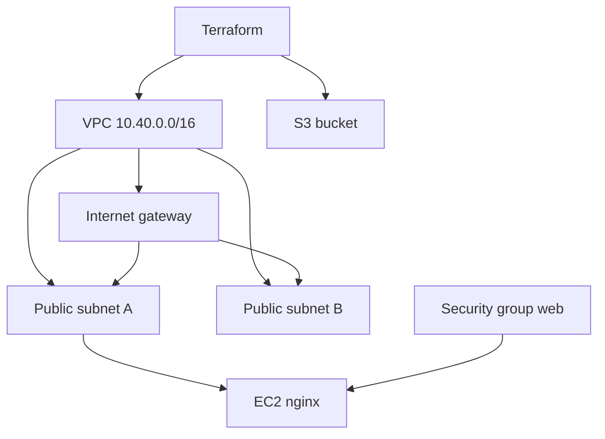

# Session 19 — Cloud infrastructure with Terraform

Student: Viraj Bhanage, roll 24BCS10274

Project file: [main.tf](main.tf)

```text
Terraform
  ├── VPC 10.40.0.0/16
  ├── Public subnet 10.40.1.0/24  (AZ a)
  ├── Public subnet 10.40.2.0/24  (AZ b)
  ├── Internet gateway + public route table
  ├── Security group (TCP 80 in, all egress)
  ├── EC2 t3.micro (Amazon Linux 2023, nginx via user data)
  └── Private S3 bucket
```



Dependencies are implicit. The instance references the subnet, the security group, and the AMI data source. The route table references the internet gateway. Terraform creates them in order.

## Commands

Change `bucket_name` in `terraform.tfvars` first.

```bash
cd homework/session-19-cloud
terraform init
terraform fmt
terraform validate
terraform plan
terraform apply
terraform output
terraform destroy
```

State is the local `terraform.tfstate` file. It is gitignored. `plan` diffs code against state. `apply` updates state. `destroy` removes every resource in that state. Do not commit state or AWS keys.

This was not applied from the workspace. Apply only if you can run `destroy` afterwards. A `t3.micro` left running is the cost to watch.

## Screenshots

- `terraform plan` showing VPC, subnets, IGW, security group, instance, and bucket
- EC2 console instance in `ap-south-1` and the VPC page
- S3 console bucket with Block Public Access on
- `terraform destroy` finishing with no resources left
