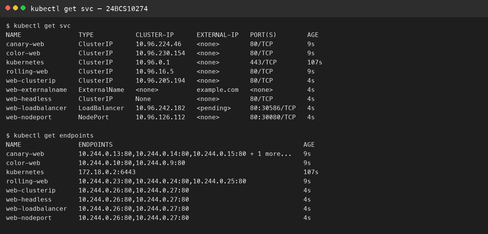

# Session 11 — Services

**Name:** Viraj Bhanage  
**Roll number:** 24BCS10274

Apply `manifests/clusterip.yaml` first. The other Services select those same Pods.

| Type | What it is for |
|---|---|
| ClusterIP | Virtual IP inside the cluster only |
| NodePort | Same Pods on node port 30080 |
| LoadBalancer | External address. On Minikube it stays pending until `minikube tunnel` |
| ExternalName | CNAME to `example.com`, no Pod selector |
| Headless | `clusterIP: None`. DNS returns Pod IPs |

A Deployment owns ReplicaSets and rollouts. A ReplicaSet only keeps a replica count. A DaemonSet runs one Pod per node. A StatefulSet gives stable names and one volume claim per Pod. A Service does not start Pods. It load-balances to ready endpoints, which is why clients call the Service name instead of a Pod IP.

A Service FQDN looks like `web-clusterip.default.svc.cluster.local`. In the same namespace the short name is enough.

CoreDNS in `kube-system` answers those names from the API and forwards everything else. An empty endpoints list can still have a ClusterIP. Connections fail until the selector matches the Pod labels.

## Evidence

