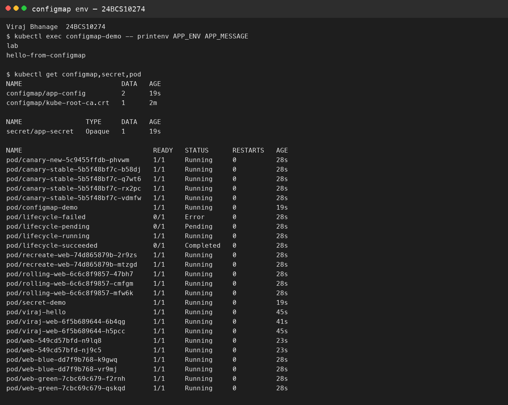

# Session 12 — ConfigMap, Secret, and Ingress

**Name:** Viraj Bhanage  
**Roll number:** 24BCS10274

`manifests/configmap.yaml` sets `APP_ENV=lab` and `APP_MESSAGE=hello-from-configmap` and injects both with `envFrom`.

`manifests/secret.yaml` uses `stringData`. The lab value is `example-only-do-not-use`. Base64 in a Secret is not encryption, so a real password does not belong in Git. `echo secret | base64` also keeps a newline, and the database then rejects the password. `echo -n` leaves the newline out.

`manifests/ingress.yaml` sends host `web.local` to Service `web-clusterip`. The Ingress object is only the route. The Ingress controller is the proxy that reads those routes. You need both.

```bash
minikube addons enable ingress
kubectl apply -f manifests/
kubectl exec configmap-demo -- printenv APP_ENV APP_MESSAGE
```

## Evidence

The ConfigMap values were read from the running pod. The Secret was applied and was not printed.


