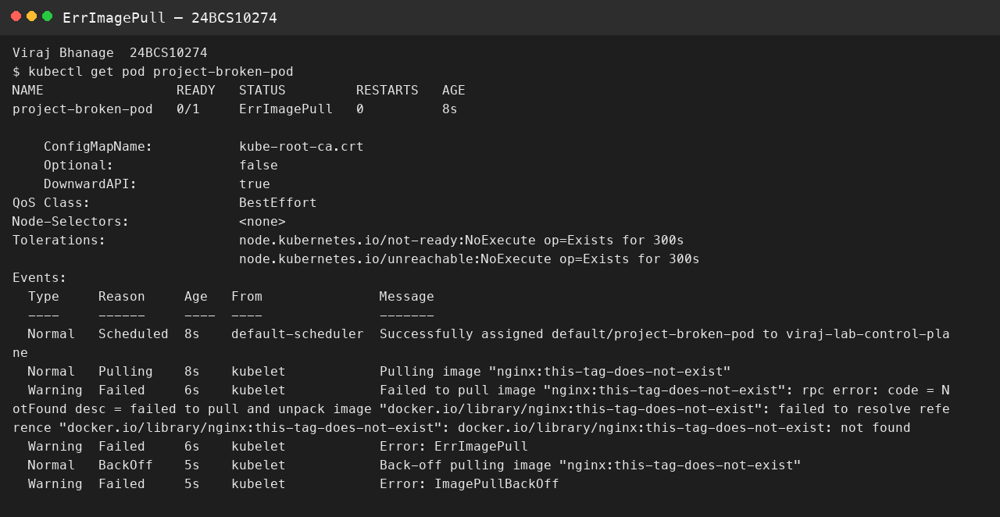

# Session 14 — Troubleshooting

**Name:** Viraj Bhanage
**Roll number:** 24BCS10274

| Scenario | Why it fails | What I change |
|---|---|---|
| crashloop | Python exits because `DATABASE_URL` is missing | Set the variable. Fixed file: `homework/session-14-troubleshooting/fixed/scenario-1-crashloop.yaml` |
| image pull | The tag does not exist | Use `nginx:1.27-alpine` |
| pending | The Pod asks for 500 CPU and 1000Gi | Ask for `100m` and `128Mi` |
| dns | The hostname is not a real Service | Use the Service FQDN from `kubectl get svc` |
| oom | The process grows past a 20Mi limit | Stop the allocation or raise the limit |

`kubectl describe pod` shows the event. `kubectl logs --previous` shows the crashed process. `mini-project/broken-pod.yaml` uses a tag that does not exist, so that Pod stays in `ErrImagePull` while the Deployment Pods stay Running.

## Evidence

