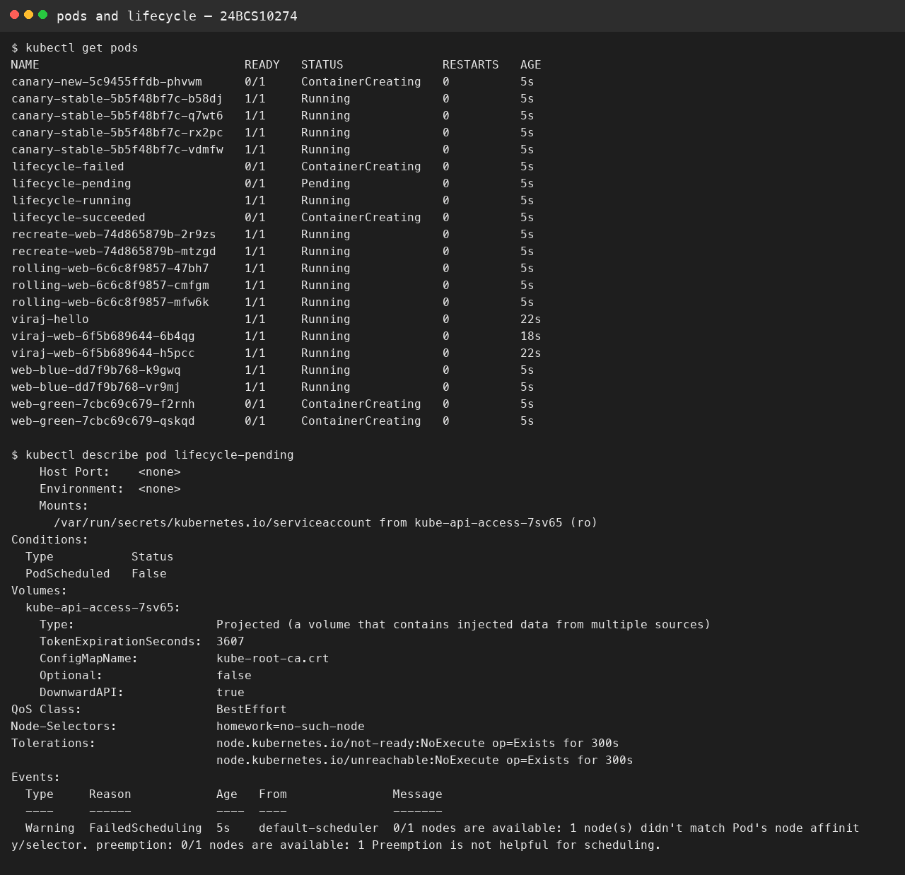

# Session 10 — Pods and deployment strategies

**Name:** Viraj Bhanage  
**Roll number:** 24BCS10274

The files in `manifests/` are my lab copies.

| File | What it shows |
|---|---|
| `rolling-update.yaml` | `maxUnavailable: 0` and `maxSurge: 1`, so a new Pod exists before an old one is removed |
| `blue-green.yaml` | Nginx is blue, Apache is green. The Service selector picks the live color |
| `canary.yaml` | 4 stable replicas and 1 canary share one Service, so about one request in five hits the canary |
| `recreate.yaml` | Old Pods are removed before new ones start, so there is a gap |
| `pod-lifecycle.yaml` | A running Pod, a succeeded Pod, a failed Pod, and a Pending Pod whose node selector matches nothing |

```bash
kubectl apply -f manifests/
kubectl get pods
kubectl describe pod lifecycle-pending
kubectl set image deployment/rolling-web web=nginx:1.25-alpine
kubectl rollout status deployment/rolling-web
```

`CrashLoopBackOff` is not a phase. Pending on `lifecycle-pending` is a scheduling miss, and `describe` puts that in Events.

## Evidence


