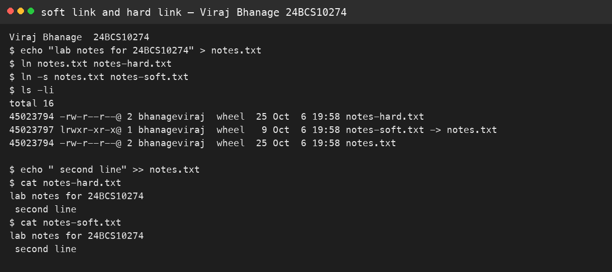
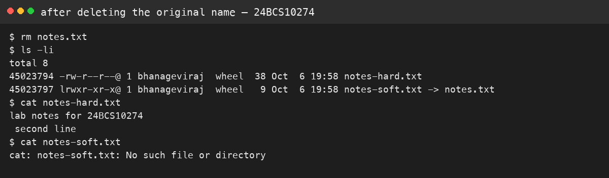
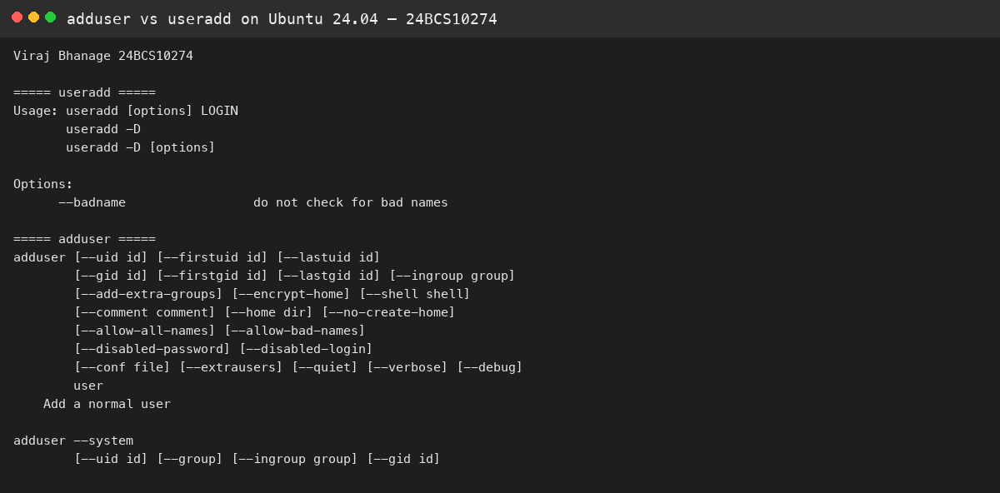
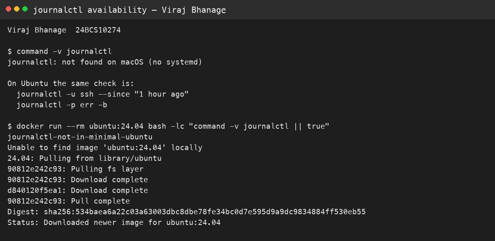
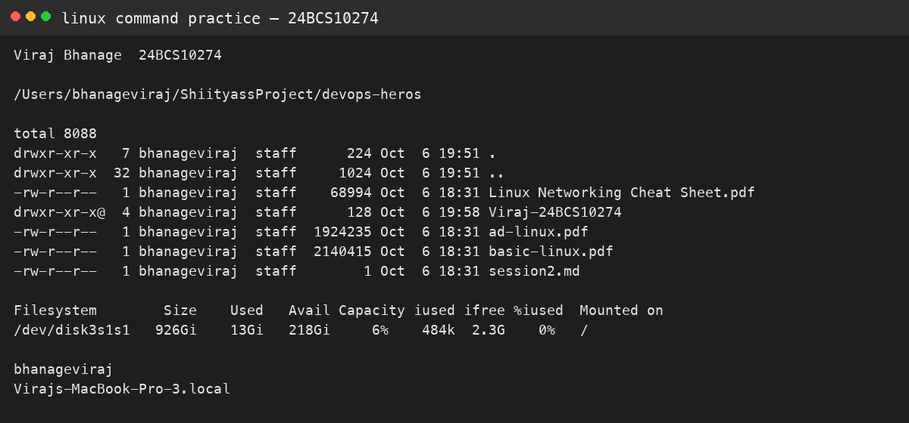

# Session 2 — Linux

**Name:** Viraj Bhanage  
**Roll number:** 24BCS10274

## Soft link and hard link

A hard link is a second name for the same inode. A symlink stores a path. I created both from `notes.txt` on this Mac.

```text
$ ln notes.txt notes-hard.txt
$ ln -s notes.txt notes-soft.txt
$ ls -li
```

Both hard names share one inode and a link count of 2. Appending to `notes.txt` shows up through the hard link and through the symlink. After `rm notes.txt`, the hard link still prints the text. The symlink fails because the path it stores is gone.

Commands:

```bash
ln notes.txt notes-hard.txt
ln -s notes.txt notes-soft.txt
```

## adduser and useradd

On Ubuntu I would create a lab user with `adduser`, not bare `useradd`. `adduser` asks for a password, creates the home directory, and copies `/etc/skel`. `useradd` is the low-level tool and can leave a user with no home and no password unless every flag is set.

This Mac does not ship either command. The Ubuntu form is:

```bash
sudo adduser viraj-lab
id viraj-lab
sudo deluser --remove-home viraj-lab
```

## journalctl

`journalctl` reads the systemd journal. Useful forms:

```bash
journalctl -u ssh --since "1 hour ago"
journalctl -p err -b
journalctl -f
```

`-u` picks one service, `-p err` keeps errors, `-b` is the current boot, `-f` follows. macOS has no systemd journal, so this was not executed here.

## Commands I actually use

`pwd`, `ls -la`, `cp`, `mv`, `rm`, `mkdir`, `touch`, `cat`, `grep`, `chmod`, `ps`, `df -h`, and `ss` or `netstat`. Each one either locates a file, changes it, or shows process and disk state.

## Evidence

These pictures were captured on this machine. The adduser comparison ran inside Ubuntu 24.04 after installing the `adduser` package, because the minimal image only has `useradd`.










