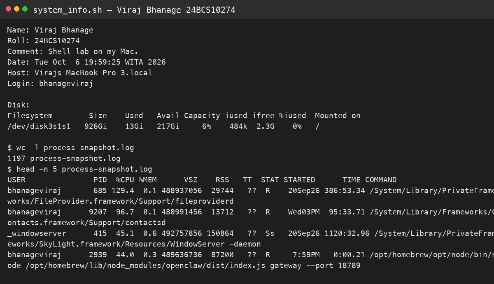
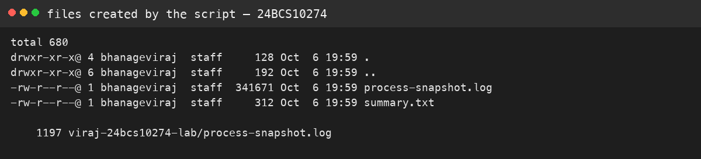

# Session 3 — Shell script

**Name:** Viraj Bhanage  
**Roll number:** 24BCS10274

Script: `system_info.sh`

It asks for a name, roll number, and comment with `read -p`. It stores the date, hostname, username, and disk usage in variables, creates `viraj-24bcs10274-lab/`, and redirects `ps aux` into `process-snapshot.log`.

Run captured on this Mac:

```text
Name: Viraj Bhanage
Roll: 24BCS10274
Comment: Session 3 lab for Viraj Bhanage.
Date: Tue Oct  6 19:51:01 WITA 2026
Host: Virajs-MacBook-Pro-3.local
Login: bhanageviraj
Disk: /dev/disk3s1s1  926Gi used about 13Gi, 6% full
```

```bash
chmod +x system_info.sh
./system_info.sh
```

## Evidence




