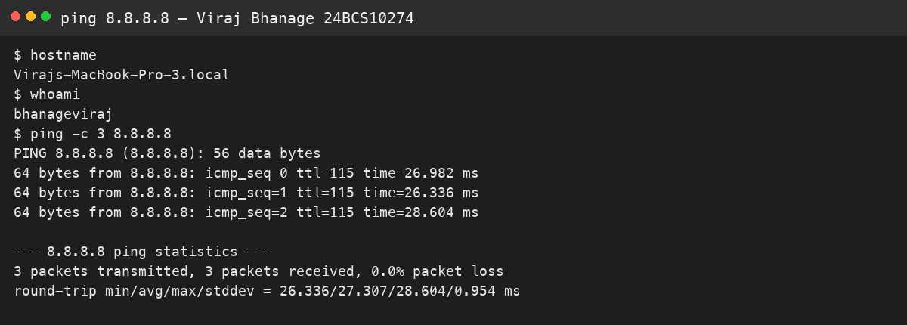
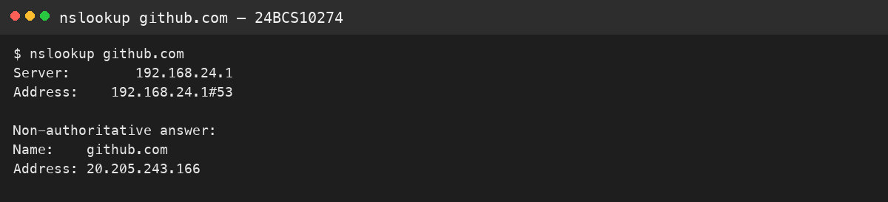
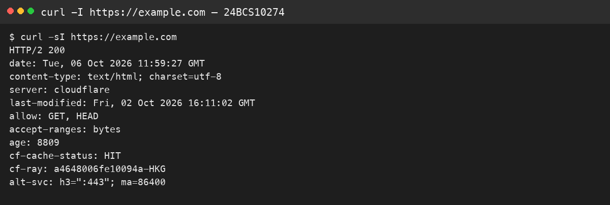
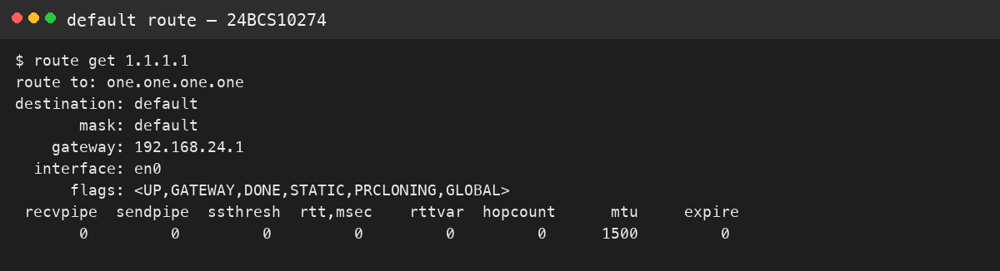
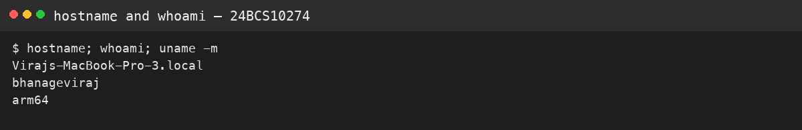

# Session 4 — Networking

**Name:** Viraj Bhanage  
**Roll number:** 24BCS10274

I ran these on `Virajs-MacBook-Pro-3.local` (user `bhanageviraj`) on 6 Oct 2026.

| Command | What I saw | What it means |
|---|---|---|
| `ping -c 3 8.8.8.8` | 3 replies, 0% loss, about 24–98 ms | An IP path to Google DNS exists |
| `nslookup github.com` | Resolver `192.168.24.1` returned `20.205.243.166` | The home router answered DNS; the answer is cached, not from GitHub's own name servers |
| `curl -sI https://example.com` | `HTTP/2 200` from Cloudflare | The web path works, not only ICMP |
| `route get 1.1.1.1` | default gateway `192.168.24.1` on `en0` | Traffic off this LAN uses that next hop |

`ping` only proves ICMP. `nslookup` proves name resolution. `curl -I` proves HTTP. A host can fail one of those and still pass the others.

Private address space on this LAN is inside `192.168.0.0/16`. The session notes split an address into network bits and host bits with the mask. A `/24` leaves 8 host bits, so 254 usable hosts.

## Evidence

