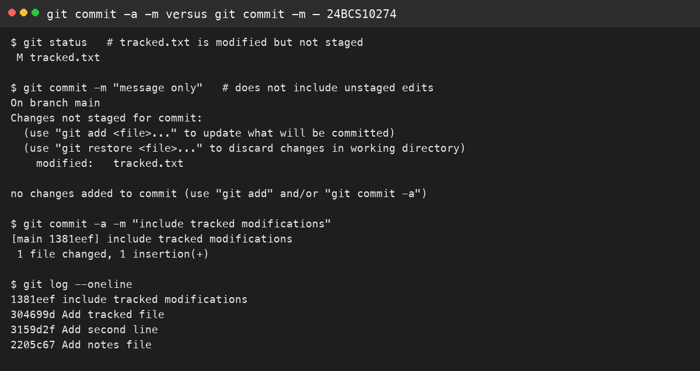
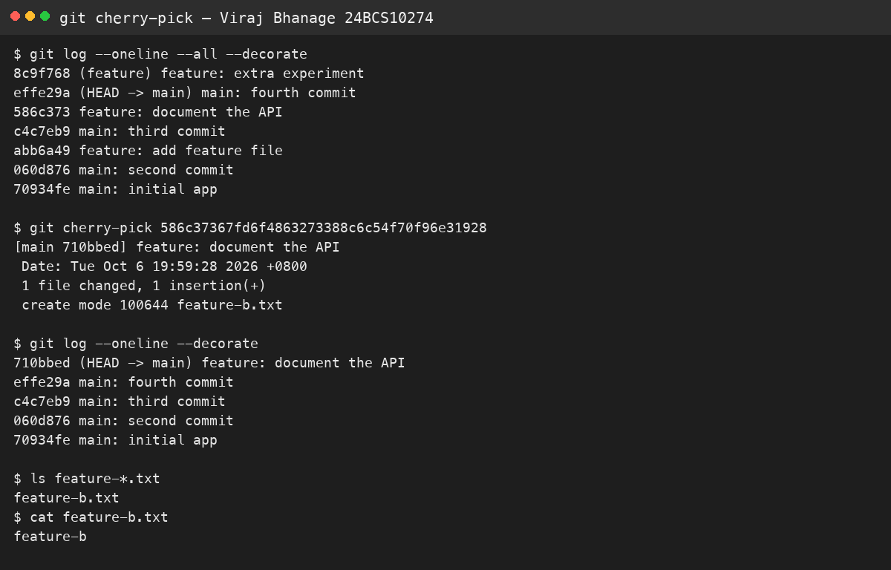

# Session 5 — Git

**Name:** Viraj Bhanage  
**Roll number:** 24BCS10274

## `git commit -m` and `git commit -a -m`

`git commit -m` records the index only. If a tracked file is modified and not staged, that command refuses to commit. `git commit -a -m` stages modifications to tracked files first. It still ignores new untracked files.

```text
$ git status
 M tracked.txt
$ git commit -m "message only"
no changes added to commit
$ git commit -a -m "include tracked modifications"
[main 1381eef] include tracked modifications
 1 file changed, 1 insertion(+)
```

## Cherry-pick

I made four commits on `main`, branched to `feature`, and added three commits that each create a different file. Back on `main` I cherry-picked only `feature: document the API`.

After that, `main` contained `feature-b.txt` and did not contain `feature-a.txt` or `feature-c.txt`. Cherry-pick copies one commit. It does not merge the branch.

The full transcript is in `homework/session-05-git/cherry-pick-output.txt`. Re-run it with `homework/session-05-git/cherry-pick-demo.sh`.

## Evidence




