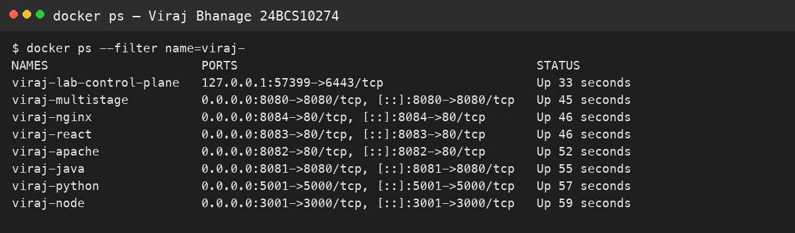
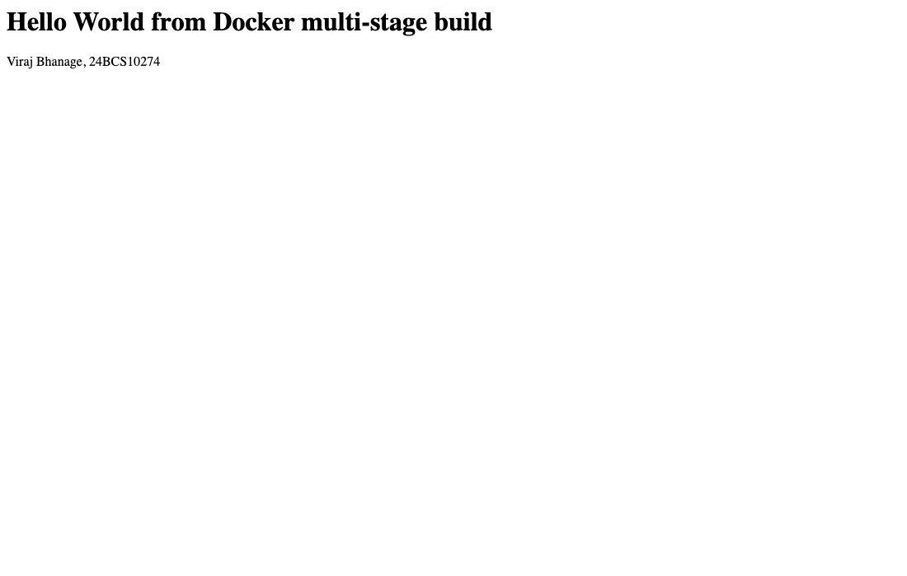

# Sessions 6 and 7 — Docker

**Name:** Viraj Bhanage  
**Roll number:** 24BCS10274

Each app is a small web page that prints my name and roll number. The multi-stage app also prints the required line `Hello World from Docker multi-stage build` and listens on port 8080.

| Folder | What it serves |
|---|---|
| `nodejs-app` | Node HTTP server |
| `python-app` | Python `http.server` |
| `java-app` | Java `HttpServer`, compiled in a JDK stage and run on a JRE stage |
| `Apache-app` | `httpd` with a static page |
| `React-app` | Vite build copied into Nginx |
| `nginx-app` | Static Nginx page |
| `multi-stage-app` | Node image that copies only `server.js` from the build stage |

Build and run from this folder:

```bash
docker build -t viraj-node:24bcs10274 nodejs-app
docker run --rm -p 3001:3000 viraj-node:24bcs10274
```

Repeat for the other folders. On this machine each app in this folder was built and opened in Chrome. The multi-stage container was published as `0.0.0.0:8080->8080/tcp`. The browser pictures are in `images/`.

## Evidence

Browser pictures of the pages this folder actually served, plus `docker ps`.





