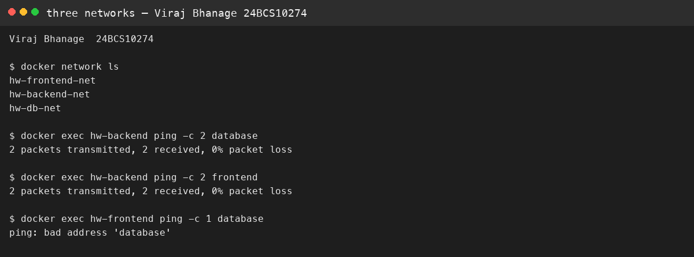

# Session 8 — Docker networks and volumes

**Name:** Viraj Bhanage  
**Roll number:** 24BCS10274

## Three networks

`docker-compose.yml` starts three containers:

- `hw-frontend` only on `hw-frontend-net`
- `hw-backend` on `hw-frontend-net` and `hw-backend-net`
- `hw-database` on `hw-backend-net` and `hw-db-net`

That is three networks, and the backend is the one attached to two of them. I ran this on Docker Desktop.

```text
networks: hw-frontend-net, hw-backend-net, hw-db-net
backend -> database: 2 packets, 0% loss
backend -> frontend: 2 packets, 0% loss
frontend -> database: ping: bad address 'database'
```

The frontend cannot resolve the database because they share no network. The MySQL password in the compose file is `lab-example-only`. It is only for this local lab.

## Host network

```bash
docker run -d --name viraj-apache-host --network host httpd:2.4-alpine
```

On Docker Desktop for Mac, host networking belongs to the Linux VM, so port 80 may not appear on the Mac. If it does not, publish `-p 8080:80` and note that next to the screenshot.

## Bind mount

`bind-mount/index.html` is mounted on Nginx at `/usr/share/nginx/html`. I edited the file while the container kept running, and the next request showed the new sentence. Nginx reads that path on each request, so a restart is not required.

## Overlay

An overlay network lets containers on different Docker hosts share one virtual network. Swarm wraps the packet in VXLAN and hands it to the other node. A single-machine lab uses bridge networks. Overlay is what keeps a service name working after a task moves to another node.

## Evidence

The frontend could reach the backend. It could not resolve `database`, because those two containers do not share a network. The bind-mount page changed after an edit to the host file, with the same container still running.




