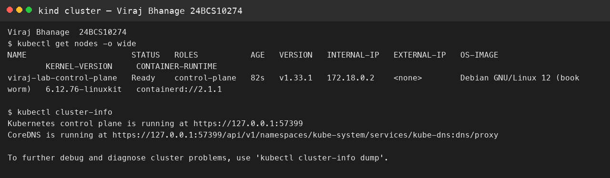
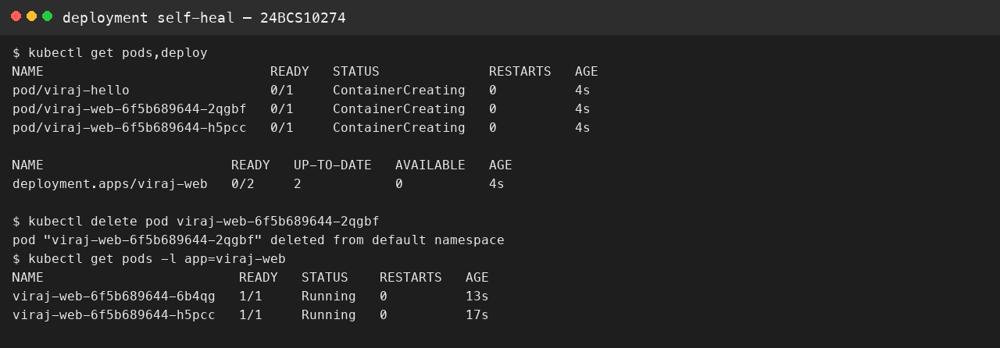

# Session 9 — Kubernetes

**Name:** Viraj Bhanage  
**Roll number:** 24BCS10274

`kubectl` talks to the API server. etcd stores the objects. The scheduler chooses a node. Controllers pull Deployments and ReplicaSets toward the spec. The kubelet starts the containers. A Service is a stable name in front of Pod IPs that change.

Minikube is not installed on this Mac yet. After it is:

```bash
brew install minikube
minikube start --driver=docker
kubectl apply -f manifests/
kubectl get pods,deploy
```

`01-pod.yaml` is one Nginx Pod labeled with my roll number. `02-deployment.yaml` asks for two replicas. Deleting one Pod should create a replacement. That replacement is the desired-state loop.

These manifests are mine. I am not using another student's screenshots. After the cluster is up, capture `kubectl get nodes` and `kubectl get pods`.

## Evidence

Captured on a local kind cluster named `viraj-lab`.




